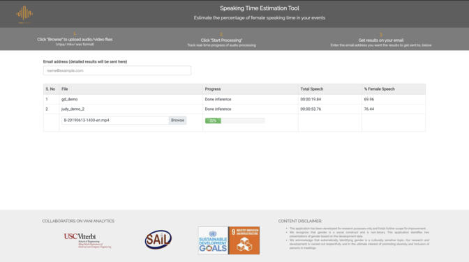

# mica-vina-app

Flask-based web application for hosting speaking time estimation pipeline using neural-network models developed in-house.
The application can be reused to host any multi-media input based pipeline.

A demo of the application can be found at https://sail.usc.edu:/mica/demos



## What do I need?
1. A Kaldi installation - follow instructions [here](https://github.com/kaldi-asr/kaldi)
2. Install redis-server:
```bash
    $ wget http://download.redis.io/releases/redis-4.0.11.tar.gz
    $ tar xzf redis-4.0.11.tar.gz
    $ cd redis-4.0.11
    $ make
```
3. Neural-Network models for Speech Activity Detection, ```sad.h5``` and Gender Identification, ```gender.h5``` (contact author)
4. Python3!!

## How do I run the app?
1. Install python dependencies:
```bash 
   $ virtualenv -p python3 venv
   $ source venv/bin/activate
   $ pip install -r requirements.txt
```
2. Start redis-server: ```redis-4.0.11/src/redis-server```
3. Edit ```speaking_time/config.py``` to reflect gmail credentials of host-email (lines 2,3) and also point to appropriate backend directories for file processing (lines 10-12).
4. Edit line 8 in ```flask_app.py``` to point to https certificate and key pair.
5. Create sqlite database for storing login credentials (instructions to be added)

### Start the workers ### 
Start multiple workers by running the following bash command
```bash
  $ for n in {1..4}
  $ do
  $  python flask_app.py runworker &
  $ done
```

### Finally, deploy the app!! ###
```bash
  $ python flask_app.py runserver --port 1011 --host 0.0.0.0 
```

You can now view the application at ```localhost:1011``` if hosted locally, or else at ```website@domain.org:1011```

## To Do
1. Instructions for dockerized application for simplified deployment.

## Acknowledgements
Project collaborators: Fernando Rivera and Tracy Tuplin @ [ITU](www.itu.int)

Website and Logo design: Swarna Hebbar (incl. website)

  
